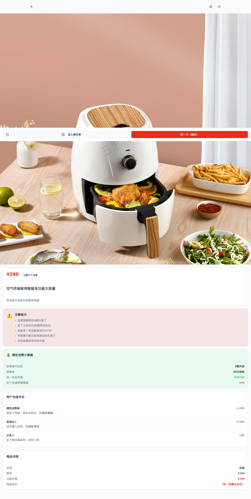
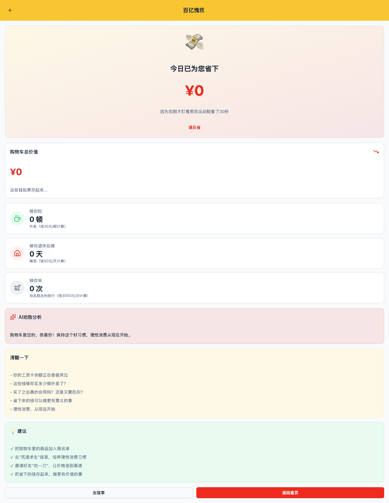
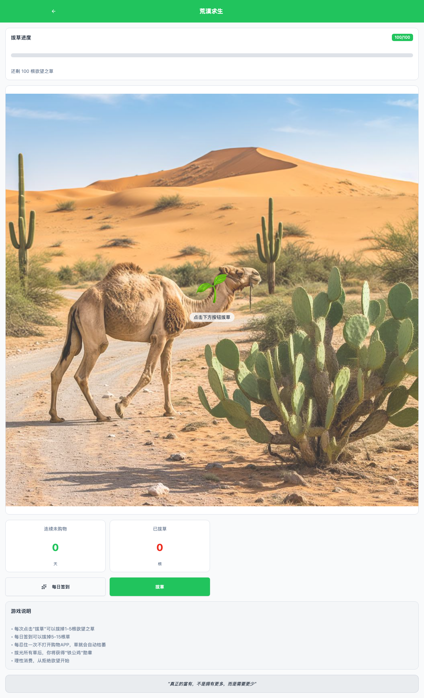
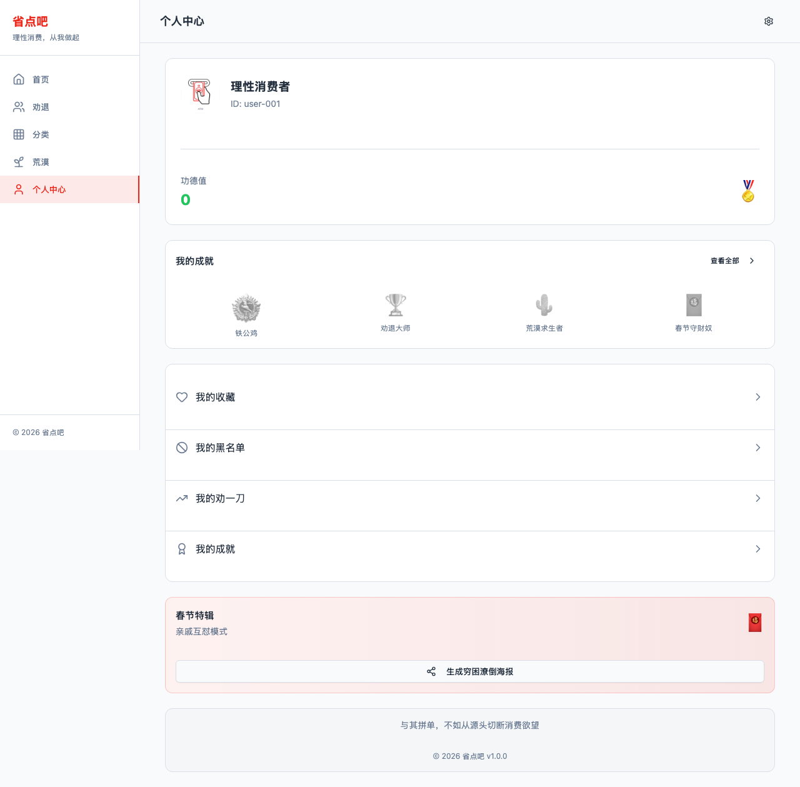

# 🛡️ 省点吧 (Save More)

> **与其拼单，不如从源头切断消费欲望。**

一款反向复刻拼多多的娱乐性 Web 应用 —— 别人帮你砍价，我们帮你涨价；别人补贴你买买买，我们用 AI 劝你省省省。

用魔法打败魔法，用幽默对抗冲动消费。

---

## ✨ 功能亮点

### 🔪 劝一刀（The Reverse Slash）
别人砍价砍到 0 元，我们帮你涨价涨到离谱。分享给好友，每个人点一下，商品价格自动上浮 20%，直到你彻底放弃购买。

### 💸 百亿愧疚（10 Billion Guilt Trip）
拼多多搞百亿补贴，我们搞百亿愧疚。AI 分析你购物车里的商品，告诉你这些钱够吃多少顿外卖、退休后够喝多少碗稀饭。

### 🌵 荒漠求生（The Ascetic Desert）
屏幕上有 100 根欲望之草，每次忍住不购物就拔掉几根。当所有草拔光变成荒漠，系统颁发「铁公鸡勋章」。

### 🛡️ 去劝退（Group Dissuasion）
看到有人想买东西？赶紧去灭火！成功劝退一个人，你的功德值 +1。

### ✨ 断念后的余韵（The Afterglow of Refusal）
放弃购买后进入沉浸式灵魂记录界面，AI 从哲学库中找出共鸣名言，让你觉得自己不是在省钱，而是在与苏格拉底、梭罗同行。

### 🧧 春节特辑
压岁钱防火墙 + 穷困潦倒海报生成器，过年必备社交利器。

---

## 📸 页面预览

### 首页


### 商品详情 - 冷静提示 & 理性消费计算器



### 百亿愧疚 - AI 劝败分析



### 荒漠求生 - 拔草大作战



### 个人中心 - 成就系统



---

## 🛠️ 技术栈

| 类别 | 技术 |
|------|------|
| **框架** | React 18 + TypeScript |
| **构建** | Vite 5 |
| **样式** | Tailwind CSS + shadcn/ui |
| **路由** | React Router v7 |
| **动画** | Motion (Framer Motion) |
| **后端** | Supabase (Edge Functions) |
| **AI** | Supabase Edge Functions (soul-echo, image-recognition, analyze-cart) |

---

## 🚀 快速开始

### 环境要求

- Node.js >= 18
- pnpm >= 8

### 安装 & 运行

```bash
# 克隆项目
git clone https://github.com/master-yp-AI/save_more.git
cd save_more

# 安装依赖
pnpm install

# 启动开发服务器
npx vite
```

浏览器访问 http://localhost:5173

---

## 📁 项目结构

```
src/
├── components/
│   ├── layouts/          # 布局组件 (TopNav, BottomNav/Sidebar)
│   ├── product/          # 商品卡片
│   ├── banner/           # 轮播广告
│   ├── activity/         # 活动入口
│   ├── festival/         # 春节特辑组件
│   └── ui/               # shadcn/ui 基础组件
├── pages/
│   ├── HomePage.tsx       # 首页 - 商品推荐
│   ├── ProductDetailPage  # 商品详情 + 冷静提示
│   ├── SlashPage.tsx      # 劝一刀 - 反向砍价
│   ├── GuiltPage.tsx      # 百亿愧疚 - AI 分析
│   ├── DesertPage.tsx     # 荒漠求生 - 拔草游戏
│   ├── DissuasionPage.tsx # 去劝退 - 社交灭火
│   ├── AfterglowPage.tsx  # 断念余韵 - 灵魂记录
│   ├── CartPage.tsx       # 购物车 - 结算按钮会跑
│   └── ProfilePage.tsx    # 个人中心 - 成就系统
├── data/                  # Mock 数据
├── hooks/                 # 自定义 Hooks
├── contexts/              # React Context
└── types/                 # TypeScript 类型定义
```

---

## 🎯 设计理念

这不是一个真正的电商 App，而是一个**用讽刺和幽默传递理性消费理念**的 AI 编程案例：

- **反转逻辑**：把拼多多的每一个"刺激消费"功能，都反转为"劝退消费"
- **AI 赋能**：用 AI 分析购物车、生成哲学共鸣、识别商品价值
- **社交传播**：劝一刀、去劝退、穷困潦倒海报等功能天然具有社交属性
- **游戏化**：成就系统、功德值、荒漠求生让"省钱"变成一种乐趣

---

## 📄 License

MIT

---

<p align="center">
  <em>冲动消费是贫穷的开始，理性消费从省点吧开始。</em>
</p>
